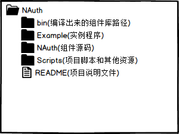
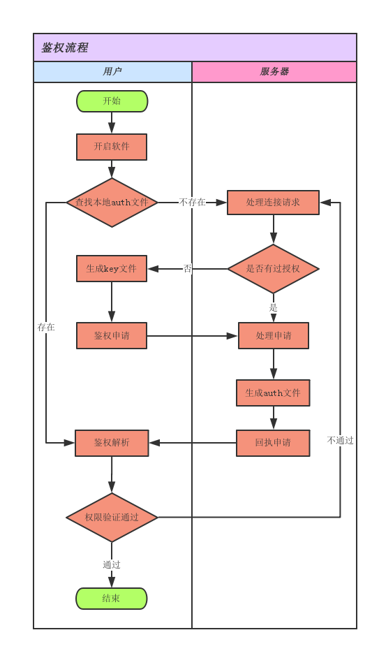

# 鉴权组件使用说明

	作者 : daodoaliang

    版本 : V 1.0.4.0

    时间 : 2016年8月19日

    邮箱 : daodaoliang@yeah.net

## 0. 项目文件说明

**项目依赖NComputerInfo NEncryptionKit**

## 1. 鉴权流程说明

* 第一次鉴权必须在联网的状态, 否则会失败;
* 非第一次鉴权客户端会先查找本地的鉴权文件, 优先解析本地的认证文件,若是认证通过则鉴权通过;
* 本地认证文件鉴权失败后会重新对服务器发起鉴权申请;
* 服务器在接收到申请后,判别若是鉴权过则把权限文件重新发送给客户端，若是没有鉴权过则生成认证文件发送给客户端;

## 2. 使用方式说明

## 3. roadmap说明

## 4. 历史版本说明

* V 1.0.1.0 初始化项目;
* V 1.0.2.0 集成 NComputerInfo V1.0.4.0 集成 NEncryptionKit V 1.0.1.0;
* V 1.0.3.0 封装key文件协议;
* V 1.0.4.0 封装liscense 文件协议;
